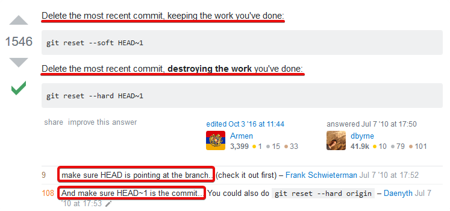

# Git

## Desfazendo Commits



```coffeescript
git reset -- soft HEAD~1
```

```coffeescript
git reset --hard HEAD~1
```

## Commit Message Template

```text
Summarize the change in less than 50 characters

Motivo:
- Explain the reasons you made this change
- Make a new bullet for each reason
- Each line should be under 72 characters

Explain exactly what was done in this commit with more depth than the
50 character subject line. Remember to wrap at 72 characters!

Include any additional notes, relevant links, or co-authors.
```

